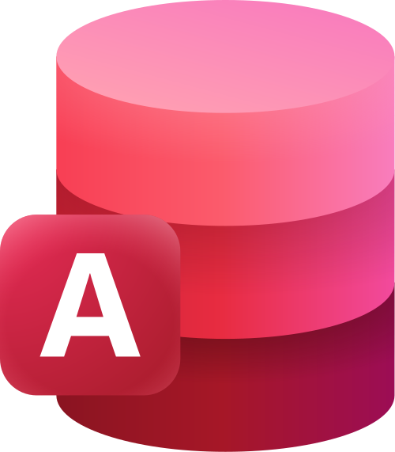

<!-- 
Para visualizar aqui no VSCODE:
ctrl+shift+p -> ">Markdown: Abrir visualização ao lado"

 -->

# 🧑‍💻 João Cardoso
### **`Analista de Dados`** 
Me chamo João Gabriel Cardoso e Silva, tenho 18 anos e sou natural do estado de São Paulo. 
Concluí o ensino médio na Etec, com o curso técnico em Desenvolvimento de Sistemas. 
Atualemte estou cursando Análise e Desenvolvimento de Sitemas na Fatec.
Sou apaixonado pela área de dados, onde demonstro esse afeto pelo meu [LinkedIn](https://www.linkedin.com/in/joão-gabriel-cardoso-e-silva-14a14z).
 

 

 ---------

<!-- 
Fui em devicon e copiei e colei o img para as imagens
https://devicon.dev/

Tambem tem o github de um cara: 'DenverCoder1', em custom-icon-badges 
https://github.com/DenverCoder1/custom-icon-badges?tab=readme-ov-file
-->

### ⚒️ Tecnologias
#### Microsoft365

 
 
 

#### Codespaces

 
 
 

 ---------

### 📚 Linguagens Principais

 

 
 
 

--------

### ⏳Ferramentas já Estudadas

   

---------

### 📊 Estátisticas
<!-- 
Repositório 'anuraghazra' possui gráficos como o de número de commits que fiz no meu github. Copieei==i o showing icons
https://github.com/anuraghazra/github-readme-stats

 -->
<!--  -->

   
  
  #### Commits
  
   

  #### Linguagens
  

 

-------

### 🔥 Ofensiva

